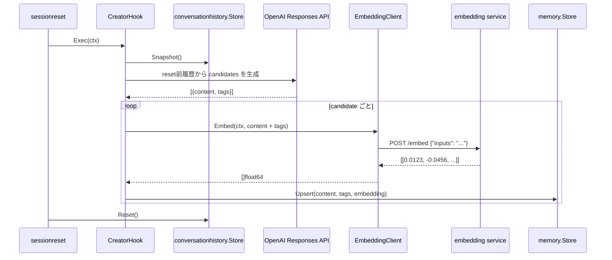

# memory hook 概要理解ドキュメント

## 1. ビジネスコンテキスト

- **解決する課題**: 会話から抽出した長期記憶を、後続の発話や検索に再利用できる土台を用意する
- **ターゲットユーザー**: smart-speaker を利用するユーザーと、メモリ機能を実装・保守する開発者
- **価値定義**: ローカル embedding server と JSON file store を使い、外部 embedding API に依存せずメモリ検索を組み立てられる

## 2. 論理構造・機能俯瞰

**主要なモデル・コンポーネント**

- **`internal/hooks/memory.OpenAIClient`**
  - reset 前の会話履歴を OpenAI Responses API に渡し、長期記憶候補を structured output として生成する
  - 候補は `content` と `tags[]` を持つ
  - 1 reset あたりの候補数は既定で最大 5 件、1 候補あたりの tag は既定で最大 5 件
  - 履歴が空の場合は OpenAI API を呼ばず、候補なしとして返す
- **`internal/hooks/memory.CreatorHook`**
  - `sessionreset.Hook` として reset 前に同期実行される
  - `conversationhistory.Store.Snapshot()` から reset 前履歴を読み、`OpenAIClient` でメモリ候補を生成する
  - 候補ごとに `content` と `tags` を連結した検索用文字列から embedding を生成し、`memory.Store.Upsert` に保存を委譲する
  - 候補生成全体に失敗した場合は error を返す
  - 候補単位の embedding / upsert 失敗は残り候補の処理を継続し、最後に error を集約して返す
- **`internal/hooks/memory.EmbeddingClient`**
  - Docker Compose 内の `embedding` service に HTTP request を送り、テキストから embedding を取得する
  - 接続先は `http://embedding:80`、モデルは `intfloat/multilingual-e5-small` 固定
  - OpenAI-compatible API ではなく、Hugging Face Text Embeddings Inference のネイティブ `POST /embed` を使う
- **`internal/states/memory.Store`**
  - メモリ本文、タグ、embedding、作成・更新時刻を JSON file に永続化する
  - content 完全一致、タグ集合一致、embedding の cosine similarity で重複を判定する
  - query embedding と保存済み embedding の cosine similarity で検索する
- **`embedding` service**
  - `docker-compose.yml` で起動するローカル embedding server
  - host port は公開せず、Go server から Compose 内部 DNS で接続する

## 3. 主要なデータフロー

### シナリオ: session reset 前の会話からメモリ候補を保存する

1. reset 発火: `sessionreset` が idle timeout 到達時に登録済み hook を reset 前に実行する。
2. 履歴取得: `CreatorHook` が `conversationhistory.Store.Snapshot()` で reset 前履歴を取得する。
3. 候補生成: `OpenAIClient` が会話履歴を JSON 文字列として Responses API に送り、`content` と `tags[]` を持つ候補配列を受け取る。
4. 候補正規化: 空の `content` は除外し、`tags` は trim、空文字除外、大文字小文字を無視した重複除外、最大件数で切り詰める。
5. embedding 生成: `EmbeddingClient` が候補ごとの `content` と `tags` を連結した検索用文字列を `POST http://embedding:80/embed` に送る。
6. 保存: `memory.Store.Upsert` が `content`、`tags`、embedding を保存し、既存 record との重複を判定する。
7. reset 継続: hook が error を返しても、`sessionreset` の既存仕様により履歴 reset、世代更新、agent status idle 化は継続される。



## 4. 詳細設計

### クラス設計

- `internal/`
  - `hooks/`
    - `memory/`
      - `openai_client.go`: reset 前会話履歴からメモリ候補を生成する
        - `NewOpenAIClient`: API key、model、endpoint、HTTP client、最大候補数、最大 tag 数を受け取る
        - `CreateCandidates`: 履歴が空なら候補なしを返し、履歴があれば Responses API の strict JSON schema で候補を生成する
        - `memoryCandidateInstructions`: 長期記憶候補の抽出ルールと出力例を定義する
        - `normalizeCandidates`: 空 `content` の除外、`tags` の trim / 重複除外 / 件数制限を行う
      - `creator_hook.go`: session reset 前にメモリ候補を生成して保存する hook を担当する
        - `NewCreatorHook`: history、candidate creator、embedder、memory upserter を受け取り、必須依存の nil を拒否する
        - `Exec`: reset 前履歴の snapshot、候補生成、embedding 生成、Store upsert を順に実行する
        - 候補単位の embedding / upsert 失敗は `errors.Join` で集約しつつ、残り候補の処理を続ける
      - `embedding_client.go`: TEI `/embed` への HTTP 通信と `number[][]` response の変換を担当する
        - `NewEmbeddingClient`: base URL の default 補完と形式検証を行う。生成時の疎通確認はしない
        - `Embed`: 空 text を拒否し、HTTP error や空 embedding を error として返す
  - `states/`
    - `memory/`
      - `store.go`: メモリ record の永続化、重複判定、検索を担当する
        - `Upsert`: content、tags、embedding 類似度で重複を判定して保存する
        - `Search`: query embedding と保存済み embedding の cosine similarity で結果を返す

### API設計

- `POST https://api.openai.com/v1/responses`: reset 前会話履歴からメモリ候補を生成する
  - system input: 長期記憶候補の抽出ルールと出力例
  - user input: reset 前の `ConversationRecord` 配列を JSON 文字列化したもの
  - structured output schema: `{ "candidates": [{ "content": string, "tags": string[] }] }`
  - 空候補は `{ "candidates": [] }` として扱う
- `POST http://embedding:80/embed`: 単一テキストから embedding vector を取得する
  - リクエスト: `{"inputs":"検索または保存対象のテキスト"}`
  - レスポンス: `[[0.0123, -0.0456, 0.0789]]`

### メモリ候補の生成ルール

- `content` は 1 候補につき 1 つの再利用可能な事実を、短く、主語が分かる自然文で表す。
- `tags` は検索補助用の短いラベルとして扱う。
- `tags` は内部 key として使いやすいよう、英単語に寄せる。必要に応じて `smart_home` や `living_room` のような snake_case を使う。
- 会話ログの生コピー、一時的な依頼、古くなりやすい状態、秘密情報らしき内容は保存候補にしない。
- 保存すべき長期記憶候補がない場合は、空の候補配列を正常系として扱う。

例:

```json
{
  "candidates": [
    {
      "content": "ユーザーは平日の朝にコーヒーを飲むことが多い",
      "tags": ["routine", "morning", "coffee", "weekday"]
    },
    {
      "content": "ユーザーはリビングの照明操作に SwitchBot ハブミニを使っている",
      "tags": ["SwitchBot", "smart_home", "living_room", "lighting", "device"]
    }
  ]
}
```

### 現時点の対象外

- LLM context への注入
- production graph への接続
