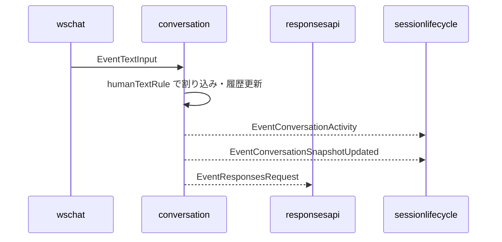
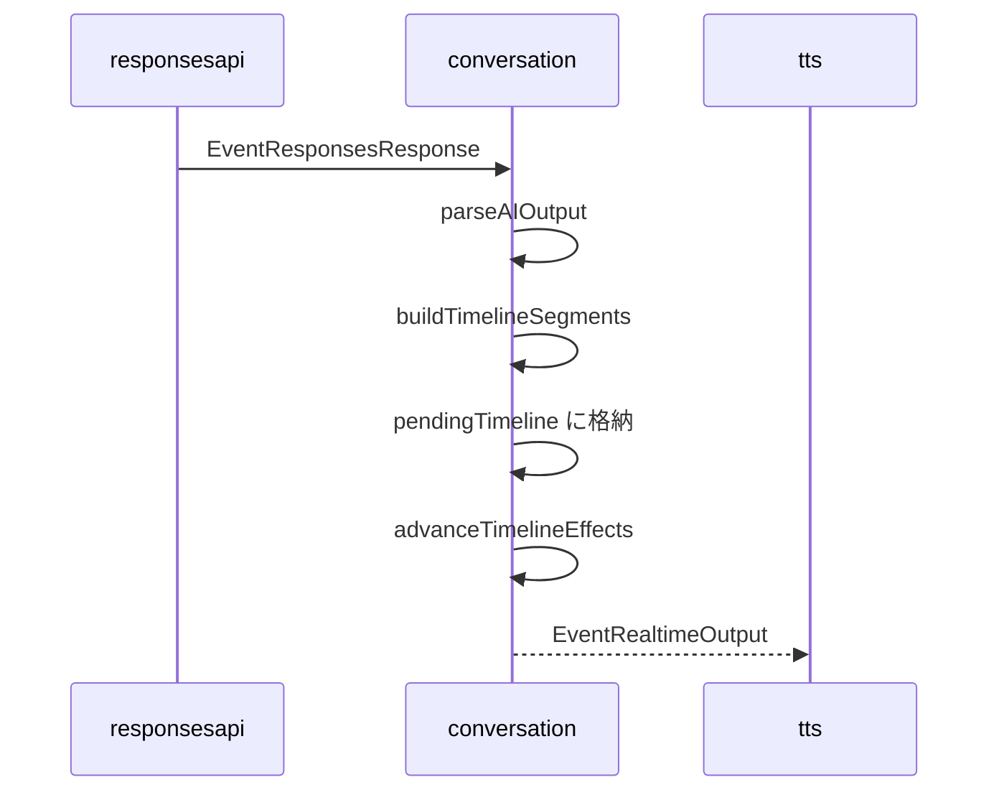
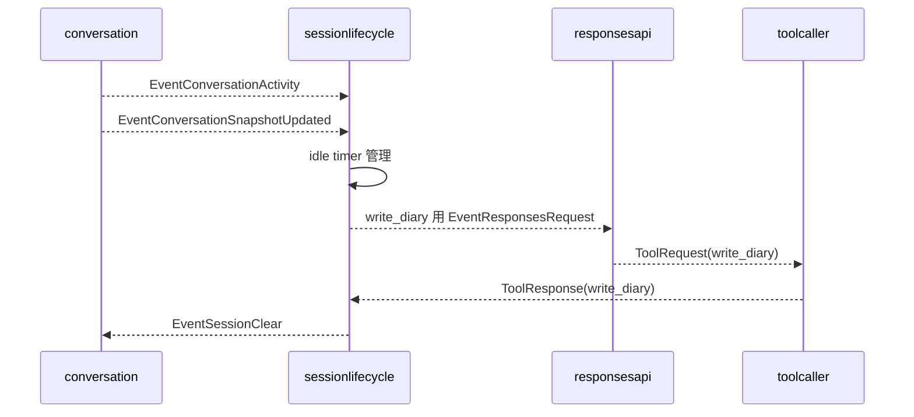

# 2. 会話オーケストレーション

元ページ: https://www.notion.so/31db3ffbf12e8163abc0db0e94672db8

## 1. ビジネスコンテキスト
- **解決する課題**: 音声会話では、LLM から文章を受け取るだけでは足りない。人の割り込み、assistant の間、複数発話の順次再生、tool 実行後の継続、TTS 完了後の次発話開始、一定時間無操作後のセッション終了までを一貫して制御する必要がある。
- **ターゲットユーザー**: スマートスピーカー利用者、会話制御の実装を保守する開発者、音声入出力や session lifecycle を調整する開発者。
- **価値定義**: `conversation` を「assistant 文面の配送場所」ではなく、会話進行の正本として理解できる。新しい会話規則や tool 連携を追加するときに、どこへ状態を置き、どこで副作用を起こすべきか判断しやすくなる。
- **現在の設計方針**: 外側は `graph.Stage` ベースの event graph を維持しつつ、会話制御の複雑さは `conversation` component 内へ閉じ込める。内部は package を分けず、`rule_*` / `runtime_*` / `response_contract` / `context_*` / `core/state/signal` の責務単位でファイル分割する。無操作時の日記化と session clear は `session lifecycle policy` に切り出し、diary は generic な state ではなく専用 store から読む。

## 2. 論理構造・機能俯瞰
**主要なモデル・コンポーネント**
- **`conversation.go`**
  - `graph.Stage` との接着層。
  - `runner` を持ち、event の受信、core の呼び出し、runtime の実行を束ねる。
- **`signal.go`**
  - `types.Event` を `conversation` 内部の `signal` へ正規化する。
  - 外の event graph と内部 state machine の境界を担当する。
- **`state.go`**
  - 会話の正本 state を持つ。
  - 会話履歴、現在再生中 utterance、pending request、retry 状態、`pendingTimeline []timelineSegment` を管理する。
- **`core.go`**
  - 会話の状態遷移本体。
  - `Handle` で rule を順に適用し、`effect` 列を返す。
- **`rule_*.go`**
  - 会話規則の集合。
  - 人の発話確定、speech start、LLM 応答、tool response、TTS 完了、session clear、timer 発火を個別 rule として持つ。
- **`effect.go`** と **`runtime_*.go`**
  - `effect` は core が返す副作用命令。
  - runtime 側が event emit、timer 制御、Responses API 要求、ログ出力を実行する。
- **`response_contract.go`**
  - LLM 応答 JSON の外部入力 DTO を定義する。
  - `parseAIOutput` が speech / wait の NDJSON 契約を検証する。
- **`context_provider.go`** と **`context_calendar_format.go`**
  - diary / calendar を system context として `ResponsesRequest.Messages` の先頭へ付与する。
  - calendar 取得は shared `CalendarClient` に委譲し、calendar 文面整形だけを `conversation` 側で行う。
- **`session lifecycle policy`**
  - `conversation` の外にある時間ベースの監督役。
  - `ConversationSnapshotUpdated` と `ConversationActivity` を受け、idle timeout 時に `write_diary` を強制し、その完了後に `EventSessionClear` を返す。

**境界の考え方**
- `conversation` の正本は内部 `SessionState` であり、generic な shared state へ投影しない。
- 他 component へ共有したい情報は `EventConversationSnapshotUpdated` と `EventConversationActivity` の 2 種類で流す。
- LLM 応答 JSON は `aiSegment` として一度受け取り、`responsesRule` が正規化済み `timelineSegment` へ変換してから内部 state に積む。
- diary / calendar / logging のような外部境界は `runtime` や provider/store に寄せ、会話ルール本体から分離する。

## 3. 主要なデータフロー
### シナリオ: 人の発話が確定し、assistant 応答が始まるまで
1. **入力受付**: `wschat` から `EventTextInput` が流れ、`signalFromEvent` が `humanTextSignal` へ変換する。
2. **会話中断**: `humanTextRule` が現在の assistant 進行を止め、pending timeline と pending request をキャンセルする。
3. **履歴更新**: user utterance を `SessionState` に追加し、会話履歴を再構築する。
4. **共有イベント発火**: `EventConversationActivity(source=human_turn_committed)` と `EventConversationSnapshotUpdated` を emit する。
5. **LLM 要求**: `requestResponseEffect` が `EventResponsesRequest` を作り、runtime が `contextProvider` を通して system context を付与して downstream へ流す。

### シナリオ: LLM 応答を受け取り、timeline を進めるまで
1. **応答受信**: `responsesRule` が `EventResponsesResponse` を受け、`RequestID` を照合する。
2. **契約検証**: `parseAIOutput` が speech / wait の NDJSON 契約を検証する。
3. **内部表現へ変換**: `buildTimelineSegments` が `aiSegment` を正規化済み `timelineSegment` へ変換する。
  - speech の URL / citation 除去。
  - wait の 0..5 秒正規化。
4. **内部 state 反映**: `pendingTimeline` に `timelineSegment` を積む。
5. **進行開始**: `advanceTimelineEffects` が先頭 segment を見て、`wait` なら timer、`speech` なら assistant 発話開始 effect を返す。
6. **白板更新**: ホワイトボード表示は通常応答ではなく、`set_whiteboard` tool が `EventWhiteboardUpdate` を emit する。

### シナリオ: TTS 完了後に次の発話へ進むまで
1. **TTS 完了通知**: `ttsEndRule` が `EventTTSEnd` を受ける。
2. **utterance 完了反映**: 対応する assistant utterance を `played` にする。
3. **待機区間消費**: `state.consumeLeadingWaitSeconds` が `timelineSegment.WaitSec` をそのまま合算する。
4. **次アクション決定**: 次の speech が残っていれば timer を張り直し、無ければ timeline を閉じる。
5. **履歴共有**: 最新会話履歴を `EventConversationSnapshotUpdated` として emit する。

### シナリオ: tool 実行結果が返るまで
1. **tool response 受信**: `toolResponseRule` が `EventToolResponse` を受ける。
2. **特殊扱い**: `write_diary` は会話文脈へ混ぜない。
3. **通常 tool 結果**: それ以外は `SpeakerTool` の utterance として会話履歴へ追加する。
4. **履歴共有**: `EventConversationSnapshotUpdated` を emit する。

### シナリオ: idle timeout で session を閉じるまで
1. **活動監視**: `session lifecycle policy` が `ConversationActivity` を受けるたびに idle timer を張り直す。
2. **日記化要求**: 一定時間無操作になると、保持している snapshot を使って `write_diary` 強制の `EventResponsesRequest` を出す。
3. **tool 完了検知**: `ToolResponse(name=write_diary)` が返ると、`session lifecycle policy` が `EventSessionClear` を emit する。
4. **会話初期化**: `conversation` が `sessionClearRule` で `SessionState` を初期化し、空の `EventConversationSnapshotUpdated` を emit する。

## 4. 詳細設計
### クラス設計
- `internal/`
  - `components/`
    - `conversation/`
      - `conversation.go`: stage の接着層。`runner` と `Config` を持つ。
        - `NewStage`: core / provider / logger を組み立てて `graph.Stage` を返す。
      - `signal.go`: `types.Event` から `signal` への変換。
        - `signalFromEvent`: 外部 event を internal signal へ正規化する。
      - `state.go`: `SessionState` と `timelineSegment` の定義。
        - `buildConversationMessages`: 再送用の会話履歴を構築する。
        - `consumeLeadingWaitSeconds`: 先頭 wait 群を消費する。
        - `resetConversation`: session clear 時に内部 state を初期化する。
      - `core.go`: 会話状態遷移の本体。
        - `Handle`: rule を順に適用して effect を返す。
        - `advanceTimelineEffects`: pending timeline から次の副作用を決める。
        - `playUtteranceEffects`: assistant 発話開始時の effect を組み立てる。
        - `retryInvalidResponseEffects`: invalid response 再試行を組み立てる。
      - `rule_human_text.go`: 人の発話確定を扱う rule。
        - `Apply`: 割り込み、履歴更新、snapshot/activity emit、LLM request を行う。
      - `rule_responses.go`: LLM 応答を扱う rule。
        - `Apply`: 応答契約の検証、timeline 反映を行う。
        - `buildTimelineSegments`: `aiSegment` を正規化済み `timelineSegment` に変換する。
      - `rule_tts_end.go`: TTS 完了を扱う rule。
        - `Apply`: utterance 完了反映、wait 消費、次の進行を行う。
        - `estimateWaitDuration`: TTS 実再生時間を踏まえて次の待機時間を計算する。
      - `rule_tool_response.go`: tool response を会話履歴へ反映する rule。
        - `Apply`: `write_diary` を除く tool 結果を utterance 化する。
      - `rule_session_clear.go`: session clear を扱う rule。
        - `Apply`: 会話 state を初期化し、空 snapshot を emit する。
      - `rule_speech_start.go`: 人の割り込み開始を扱う rule。
      - `rule_timer_elapsed.go`: conversation 内 timer 満了を扱う rule。
      - `rule_timer_fired.go`: `schedule_timer` の発火通知を assistant message へ変換する rule。
      - `rule_registry.go`: rule の適用順序を定義する。
      - `effect.go`: core と runtime の間でやり取りする副作用命令の型。
      - `runtime_apply.go`: effect dispatcher。
        - `applyEffects`: effect の種類に応じて実処理を呼び分ける。
      - `runtime_emit.go`: downstream event emit。
        - `emit`: `types.Event` を downstream へ流す。
      - `runtime_timer.go`: conversation 内 timer 制御。
        - `startTimer`: 次の wait 区間や timer elapsed を扱う。
        - `stopTimer`: timer を停止する。
      - `runtime_request.go`: Responses API 要求の実行。
        - `applyRequestResponseEffect`: context 付与後に `EventResponsesRequest` を emit する。
      - `runtime_log.go`: runtime 側 logging の適用。
      - `runtime_effect_builders.go`: snapshot/activity 用 event builder。
      - `runtime_logger.go`: 会話ログ JSONL の永続化。
        - `Write`: 1 行分の会話ログを書き出す。
        - `Close`: writer/file を閉じる。
      - `response_contract.go`: LLM 応答 JSON の DTO と契約検証。
        - `parseAIOutput`: speech / wait の NDJSON の妥当性を検証する。
      - `context_provider.go`: diary / calendar の system context 付与。
        - `WithSystemContexts`: request に diary と calendar を先頭追加する。
        - `buildCalendarContext`: shared `CalendarClient` から直近予定を組み立てる。
      - `context_calendar_format.go`: calendar prompt 整形補助。
        - `formatCalendarPrompt`: `[今日] / [明日] / [明後日]` 形式へ整形する。
      - `conversation_integration_test.go`: stage 境界の統合テスト。
      - `response_contract_test.go`: 応答契約と timeline 正規化の単体テスト。
    - `sessionlifecycle/`
      - `sessionlifecycle.go`: idle timeout を監督する component。
        - `handleActivity`: 最終活動時刻を更新し idle timer を張り直す。
        - `handleIdleTimeout`: `write_diary` 専用 request を出す。
        - `handleToolResponse`: `write_diary` 完了を受けて session clear を出す。
  - `types/`
    - `event.go`: event graph で流れる `EventKind` と payload 型の入口。
    - `types.go`: `OutputLine`, `ConversationSnapshot`, `ConversationActivity`, `ResponsesRequest`, `ResponsesResponse` などの共通 DTO。

### イベント設計
- `EventTextInput`: user 発話確定の入口。
- `EventSpeechStart`: 人の割り込み開始の入口。
- `EventResponsesRequest`: Responses API 呼び出し要求。
- `EventResponsesResponse`: LLM 応答受信。
- `EventToolResponse`: tool 実行結果受信。
- `EventConversationSnapshotUpdated`: 最新会話履歴の共有。
- `EventConversationActivity`: 会話活動の共有。
- `EventWhiteboardUpdate`: app 画面 whiteboard の更新。
- `EventTTSEnd`: assistant 音声再生完了。
- `EventSessionClear`: session lifecycle から会話初期化を依頼するイベント。

### 設計上の重要ポイント
- **外部入力 DTO と内部 state を分ける**: `aiSegment` は JSON 契約専用、`timelineSegment` は内部実行専用。
- **正規化は受け入れ時に 1 回だけ**: speech / wait の正規化は `responsesRule` の `buildTimelineSegments` に集約し、core/state 側で再正規化しない。
- **共有は event で行う**: generic な shared state を持たず、snapshot/activity の domain event だけを外へ流す。
- **副作用は runtime に寄せる**: event emit、timer、request、logging は runtime 側で実行し、rule/core は何を起こすかだけを決める。

## 5. 参照実装
- `internal/components/conversation/conversation.go`
- `internal/components/conversation/signal.go`
- `internal/components/conversation/state.go`
- `internal/components/conversation/core.go`
- `internal/components/conversation/rule_*.go`
- `internal/components/conversation/effect.go`
- `internal/components/conversation/runtime_*.go`
- `internal/components/conversation/response_contract.go`
- `internal/components/conversation/context_provider.go`
- `internal/components/conversation/context_calendar_format.go`
- `internal/components/conversation/conversation_integration_test.go`
- `internal/components/conversation/response_contract_test.go`
- `internal/components/sessionlifecycle/sessionlifecycle.go`
- `internal/types/event.go`
- `internal/types/types.go`
